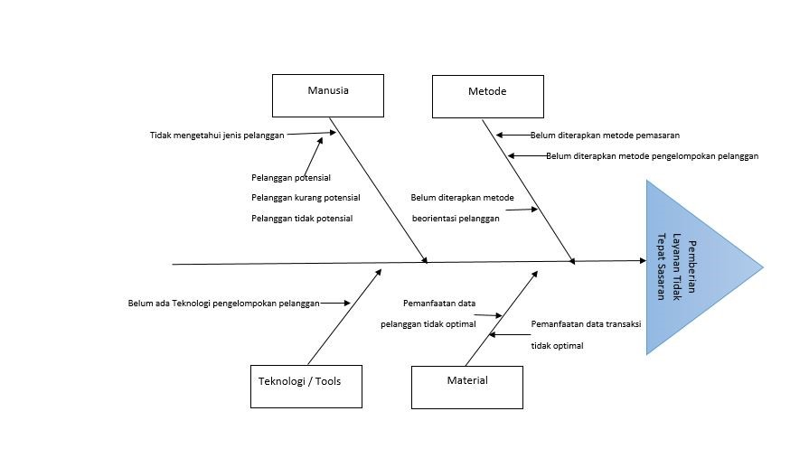

# Magang-Yayasan-It-Nurul-Ilmi-Aini-Web-Dan-Visualization

              Masalah di hadapi pelanggan (murid wali) yang akan masuk sekolah dan di tambah dengan permasahalan covid 19 dengan ada nya penelitian ini di harapakan dapat memberikan solusi 
              1 peningkatan informasi tentang sekolah
              2 peningkatan pelayanan terhadapa sekolah
              3 meminimalisir kesalahan yaitu alokasi informasi 
              4 meningkatkan agrditas sekolah laporan tahun ketahun yang tidak pasti karnal data sering hilang
              5 membuat suatu keputusan dengan membuat laporan yang bermanfaat untuk yang terjadi akan datang 
              

              Visualization Study Tracer Akreditas\
 

              Data Sementara Di HasilKan Pada Pengisian Pada Siswa Siswa Alumni
 

              Website
 

